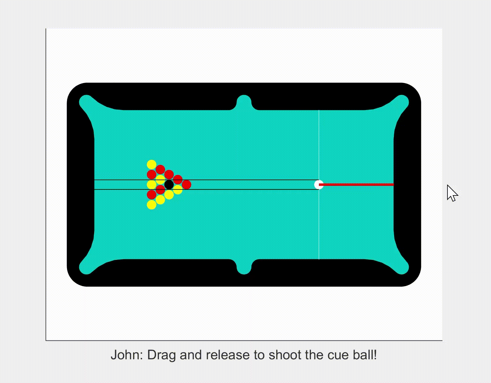

# Pool Game
a game based on 2D collision simulation with Matlab

  

## Project Description
My Pool_Game project implemented a simple 2D collision engine that predicts and calculates the movement and collision of balls. The engine performs relatively efficiently, allowing smooth animation while multiple balls are in collision (with occasional lags though). I developed a virtual pool game with the engine for everyone interested to have fun with their friends!

## File Usage

- Pool_Game: [Pool_Game](Pool_Game.m) has all the 2D collision simulation for a pool game and games rules implemented. Run the program and have fun with your friends!
- Pool: [Pool](Pool.m) includes all the necessary 2D collision simulation but not the game rules. It provides more freedom when you're playing around with the program, just in case your rules are different from mine.
- Collision_box: [Collision_box](Collision_box.m) performs 2D collision simulation in a "box" rather than a pool table with pockets.
